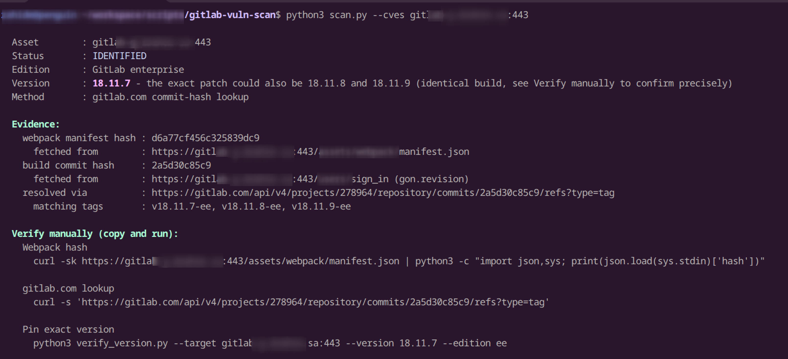
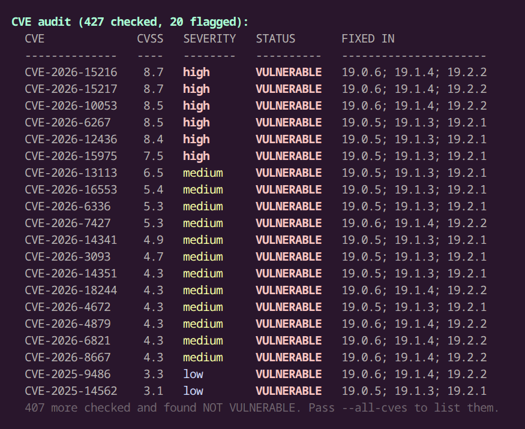

# gitlab-vuln-scan

This tool finds out what version of GitLab a server is
running, and checks that version against known CVEs. It works without
logging in and without nmap, and it shows the raw evidence behind every
result so you can double-check it manually.

```
$ python3 scan.py --cves gitlab.example.com:443

  Asset        : gitlab.example.com:443
  Status       : IDENTIFIED
  Edition      : GitLab enterprise
  Version      : 17.4.2
  Method       : gitlab.com commit-hash lookup

  Evidence:
    webpack manifest hash : 3f9a1c7e2b8d4f6a1c9e
      fetched from        : https://gitlab.example.com:443/assets/webpack/manifest.json
    build commit hash     : 7b2e9f0a1d3
      fetched from        : https://gitlab.example.com:443/users/sign_in (gon.revision)
    resolved via          : https://gitlab.com/api/v4/projects/278964/repository/commits/7b2e9f0a1d3/refs?type=tag
      matching tags       : v17.4.2-ee

  Verify manually (copy and run):
    Webpack hash
      curl -sk https://gitlab.example.com:443/assets/webpack/manifest.json | python3 -c "import json,sys; print(json.load(sys.stdin)['hash'])"

    gitlab.com lookup
      curl -s 'https://gitlab.com/api/v4/projects/278964/repository/commits/7b2e9f0a1d3/refs?type=tag'

  CVE audit (427 checked, 1 flagged):
    CVE              CVSS   SEVERITY   STATUS       FIXED IN
    --------------   ----   --------   ----------   ----------------------
    CVE-2026-15217    8.7   high       VULNERABLE   19.0.6; 19.1.4; 19.2.2
```




## Version detection

GitLab does not show its version number to users who are not logged
in. Older tools used to read it off the `/help` page or a hidden field on
the login page. GitLab has since removed both.

One thing is still public on almost every version: the hash of GitLab's
own front-end asset bundle, at `/assets/webpack/manifest.json`. The
browser has to fetch this file before login even works, so it cannot be
hidden. This tool reads that hash and looks up which GitLab version, or
versions, produced it.

Sometimes more than one version shares the exact same hash. This usually
happens when a patch release only changed backend code, not the front
end. When that happens, the tool states the lowest matching version as
confirmed, since the server is certainly running at least that one, and
names the later patches it could also be, since those happen to share the
same build. A second command, `verify_version.py`, can pin down the exact
one.

### How the version is resolved

- **Primary source**: a live query to gitlab.com's own public API
  (`gitlab-org/gitlab` + `gitlab-org/gitlab-foss`), checked fresh on
  every run, not a local file that can go stale.
- **Fetched from the target**: the webpack manifest hash
  (`/assets/webpack/manifest.json`) and, when exposed, the `gon.revision`
  build commit hash (`/users/sign_in`).
- **Commit hash → version**: the commit is sent to gitlab.com's
  `/repository/commits/{sha}/refs?type=tag` for candidate tags, then each
  candidate is checked against its own `/repository/tags/{name}`. Only
  tags whose own tip commit matches exactly are kept; a tag that merely
  descends from that commit (a later patch built on top) is filtered out.
- **Webpack hash → version**: used only as a fallback, via the local
  `gitlab_hashes.json`, when `gon.revision` isn't exposed.
- **Freshness**: current the moment it runs, since gitlab.com has every
  release tag as soon as GitLab ships it.
- **Ambiguity**: If more than one version shares an identical build, the tool names the lowest as the
  confirmed floor and lists what else it could be; `verify_version.py`
  pins the exact one by diffing against the real Docker image.

---

## Quick start

```
git clone https://github.com/zahidec0de/gitlab-vuln-scan.git
cd gitlab-vuln-scan
```

---

## Usage cases

**"I have one server and want to know its GitLab version."**
```
python3 scan.py gitlab.example.com:443
```

**"I have a list of servers to check."**
```
python3 scan.py gitlab.example.com:443 10.0.0.5:8443 10.0.0.6:443
```
Or from a file, one `host:port` per line (blank lines and `#` comments are skipped):
```
python3 scan.py -l targets.txt
```
The file and inline targets can be combined: `python3 scan.py -l targets.txt extra-host:443`.

More than one target adds a summary table at the end: one row per server
with its version and, with `--cves`, its highest CVSS score. With `--cves`
this is followed by a second table, "Findings", listing every affected CVE
across all servers in one place, each row carrying its own server and
version, so it can be copied straight into a report.

**"I want to know if a server has any known vulnerabilities."**
```
python3 scan.py --cves gitlab.example.com:443
```

**"A report says a server is running version X, and I want to confirm or disprove that."**
```
python3 verify_version.py --target gitlab.example.com:443 --version 17.4.2 --edition ee
```
This gives a plain CONFIRMED or MISMATCH answer.

**"I want the results in a format I can feed into another tool or report."**
```
python3 scan.py --json --cves gitlab.example.com:443
```

---

## `scan.py`, detect a version and optionally check CVEs

```
python3 scan.py HOST:PORT [HOST:PORT ...]
python3 scan.py -l targets.txt
python3 scan.py --cves HOST:PORT [HOST:PORT ...]
```

**What gitlab-vuln-scan checks:**
1. The webpack asset hash at `/assets/webpack/manifest.json`.
2. The build commit shown at `/users/sign_in`. This is only present on
   some versions, since GitLab has been phasing it out.
3. If step 2 found something, it is checked directly against gitlab.com's
   own records. This is exact and always up to date.
4. Otherwise, the webpack hash is looked up in `gitlab_hashes.json`, a
   local file built from every official GitLab Docker image.

**With `--cves`**, each version scan.py found is checked against
`gitlab_cves.json`, a list of known GitLab CVEs and the exact version
ranges they affect. Each result is one of:

| Result | Meaning |
|---|---|
| `VULNERABLE` | the version is inside the affected range |
| `NOT VULNERABLE` | the version is outside the affected range |
| `NEEDS VERIFICATION` | scan.py could not pin the exact patch, and the possible versions include both safe and vulnerable ones |

Every result also shows the raw data it was based on (hashes, URLs, API
responses), along with ready-to-run `curl` commands, so you can
double-check it yourself instead of trusting this tool blindly.

### Flags

| Flag | What it does |
|---|---|
| `--subdir /path` | GitLab is installed under a sub-path, e.g. behind a reverse proxy at `/gitlab` |
| `--timeout N` | seconds to wait per request (default 15) |
| `--no-insecure` | verify TLS certificates (off by default, since many internal servers use self-signed certs) |
| `--cves` | check the version against known CVEs |
| `--cve CVE-ID` | only check one specific CVE |
| `--all-cves` | also list CVEs the target is NOT vulnerable to (off by default, since the list is 400+ long) |
| `--remote-db` | use the latest hash database from GitHub instead of the local copy |
| `--remote-cve-db` | same, for the CVE database |
| `--json` | print results as JSON instead of plain text |

Exit code: `0` if every target was identified and nothing came back
vulnerable, `1` otherwise.

---

## `verify_version.py`, confirm one exact version

Use this when you already suspect a specific version and want a definite
yes or no.

```
python3 verify_version.py --target HOST:PORT --version 17.4.2 --edition ee
python3 verify_version.py --target HOST:PORT --version 17.4.2 --edition ee --cves
```

It downloads the hash for that exact version directly from Docker
Hub (no need to install Docker) and compares it byte-for-byte against
what the server returns. If they match, it is confirmed, not guessed.

```
$ python3 verify_version.py --target gitlab.example.com:443 --version 17.4.2 --edition ee

  Asset          : gitlab.example.com:443
  Status         : CONFIRMED
  Claimed        : GitLab ee 17.4.2
  Live hash      : 3f9a1c7e2b8d4f6a1c9e (from https://gitlab.example.com:443/assets/webpack/manifest.json)
  Reference hash : 3f9a1c7e2b8d4f6a1c9e (from gitlab/gitlab-ee:17.4.2-ee.0, Docker Hub registry, streamed)
```

Same `--cves`, `--cve`, `--all-cves`, and `--json` flags as `scan.py`.
Exit code: `0` confirmed, `1` mismatch, `2` error (for example, the
server was unreachable).


## Keeping the data up to date

Two files carry all the reference data, and both refresh themselves
automatically once a day through GitHub Actions (see
`.github/workflows/main.yml`):

- **`gitlab_hashes.json`**: asset hash to GitLab version. Rebuilt by
  `automation/get_gitlab_hashes.py`, which reads every official GitLab
  Docker image on Docker Hub.
- **`gitlab_cves.json`**: GitLab CVEs and the exact versions they affect.
  Rebuilt by `automation/get_gitlab_cves.py`, which pulls new CVEs
  straight from NVD (the U.S. National Vulnerability Database) instead of
  depending on a third-party lookup at scan time.

To run either update by hand:
```
cd automation
python3 get_gitlab_hashes.py ../gitlab_hashes.json
python3 get_gitlab_cves.py ../gitlab_cves.json --since-days 30
```

---

## Credits

Built on the version-fingerprinting idea from
[righel/gitlab-version-nse](https://github.com/righel/gitlab-version-nse).
Apache-2.0, same license as this project.
