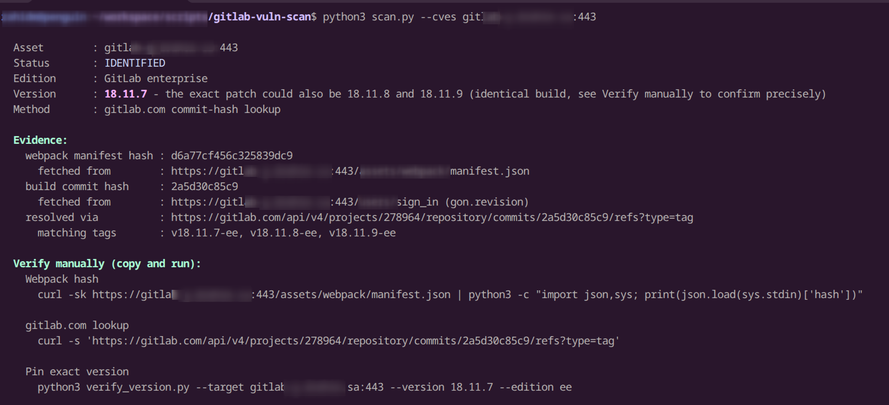
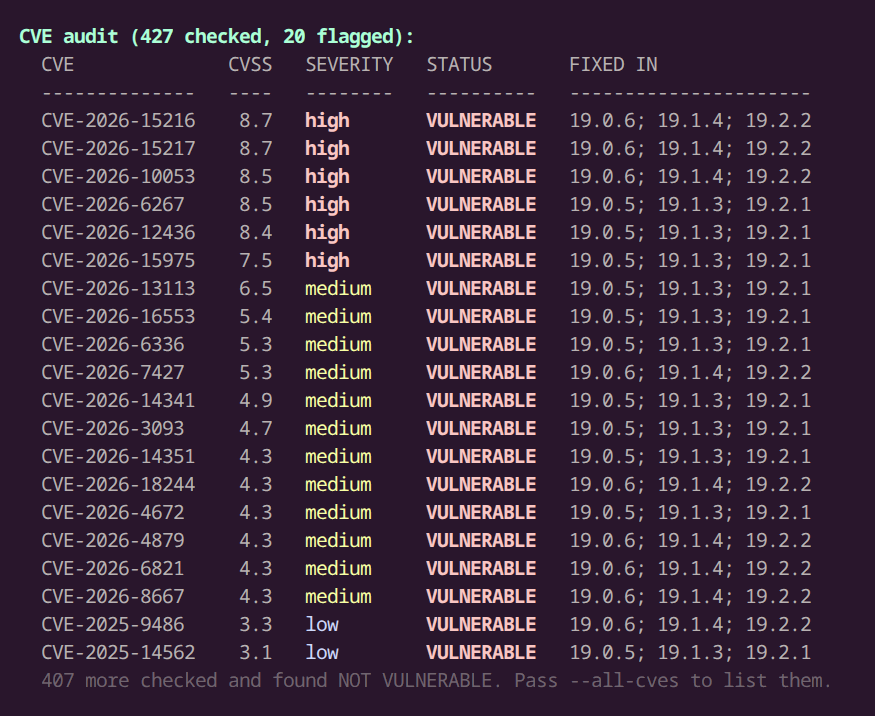

# gitlab-vuln-scan

This tool detects what version of GitLab a server is running and checks that version against known CVEs. It works without logging in and without nmap, and it shows the raw evidence behind every result so you can double-check it manually.





## Version detection

GitLab does not show its version to users who are not logged in. Older tools read it from `/help` or a hidden login-page field, but GitLab has removed both.

The front-end asset hash at `/assets/webpack/manifest.json` is still public. This tool reads that hash and checks which GitLab version or versions produced it.

If multiple versions share the same hash, it confirms the lowest matching version and lists the later patches that could also match. `verify_version.py` can pin down the exact version.


## Quick start

```
git clone <this repo>
cd gitlab-vuln-scan
python3 scan.py gitlab.example.com:443
```

---

## Usage cases

**"I have one server and want to know its GitLab version."**
```
python3 scan.py gitlab.example.com:443
```

**"I have a list of servers to check."**
```
python3 scan.py gitlab.example.com:443 10.0.0.5:8443 10.0.0.6:443
```
Or from a file, one `host:port` per line (blank lines and `#` comments are skipped):
```
python3 scan.py -l targets.txt
```
The file and inline targets can be combined: `python3 scan.py -l targets.txt extra-host:443`.


**"I want to know if a server has any known vulnerabilities."**
```
python3 scan.py --cves gitlab.example.com:443
```
By default only the CVEs the server is vulnerable to are listed. To also
list every CVE that was checked and found NOT VULNERABLE:
```
python3 scan.py --cves --all-cves gitlab.example.com:443
```

**"I want to scan specific CVE."**
```
python3 scan.py --cves --cve CVE-2026-15217 --all-cves gitlab.example.com:443
```

**"GitLab is behind a reverse proxy under a sub-path, e.g. `https://host/gitlab`."**
```
python3 scan.py --subdir /gitlab host.example.com:443
```

**"A report says a server is running version X, and I want to confirm or disprove that."**
```
python3 verify_version.py --target gitlab.example.com:443 --version 17.4.2 --edition ee
```
This gives a plain CONFIRMED or MISMATCH answer.

**"I want the results in a format I can feed into another tool or report."**
```
python3 scan.py --json --cves gitlab.example.com:443
```

---

## `scan.py`, detect a version and optionally check CVEs

```
python3 scan.py HOST:PORT [HOST:PORT ...]
python3 scan.py -l targets.txt
python3 scan.py --cves HOST:PORT [HOST:PORT ...]
```

### Flags

| Flag | What it does |
|---|---|
| `HOST:PORT ...` | one or more targets |
| `-l FILE`, `--input-list FILE` | read targets from a file, one `host:port` per line (can be combined with inline targets) |
| `--subdir /path` | GitLab is installed under a sub-path, e.g. behind a reverse proxy at `/gitlab` |
| `--timeout N` | seconds to wait per request (default 15) |
| `--no-insecure` | verify TLS certificates (off by default, since many internal servers use self-signed certs) |
| `--no-gitlab-com` | skip the gitlab.com commit-hash lookup and use only the local hash database (for example, when there is no internet access) |
| `--db FILE` | use a different `gitlab_hashes.json` file instead of the one next to the script |
| `--remote-db` | use the latest hash database from GitHub instead of the local copy |
| `--cves` | check the version against known CVEs |
| `--cve CVE-ID` | **requires `--cves`**: only check this one CVE |
| `--all-cves` | **requires `--cves`**: also list CVEs the target is NOT vulnerable to (off by default, since the list is 400+ long) |
| `--cve-db FILE` | use a different `gitlab_cves.json` file instead of the one next to the script |
| `--remote-cve-db` | use the latest CVE database from GitHub instead of the local copy |
| `--json` | print results as JSON instead of plain text |

Exit code: `0` if every target was identified and nothing came back
vulnerable, `1` otherwise.

---

## `verify_version.py`, confirm one exact version

Use this when you already suspect a specific version and want a definite
yes or no.

```
python3 verify_version.py --target HOST:PORT --version 17.4.2 --edition ee
python3 verify_version.py --target HOST:PORT --version 17.4.2 --edition ee --cves
python3 verify_version.py --target HOST:PORT --version 17.4.2 --edition ee --cves --cve CVE-2026-15217 --all-cves
```

It downloads the hash for that exact version from Docker
Hub (no need to install Docker) and compares it byte-for-byte against
what the server returns. If they match, it is confirmed, not guessed.

```
$ python3 verify_version.py --target gitlab.example.com:443 --version 17.4.2 --edition ee

  Asset          : gitlab.example.com:443
  Status         : CONFIRMED
  Claimed        : GitLab ee 17.4.2
  Live hash      : 3f9a1c7e2b8d4f6a1c9e (from https://gitlab.example.com:443/assets/webpack/manifest.json)
  Reference hash : 3f9a1c7e2b8d4f6a1c9e (from gitlab/gitlab-ee:17.4.2-ee.0, Docker Hub registry, streamed)
```

### Flags

| Flag | What it does |
|---|---|
| `--target HOST:PORT` | **required**: the server to check (one target only) |
| `--version X.Y.Z` | **required**: the version you want to confirm |
| `--edition ce\|ee` | **required**: Community (`ce`) or Enterprise (`ee`) edition |
| `--tag-suffix S` | Docker tag suffix (default `.0`, i.e. `17.4.2-ee.0`) |
| `--subdir /path` | GitLab is installed under a sub-path |
| `--timeout N` | seconds to wait per request (default 15) |
| `--no-insecure` | verify TLS certificates |
| `--cves` | once the version is confirmed, check it against known CVEs |
| `--cve CVE-ID` | **requires `--cves`**: only check this one CVE |
| `--all-cves` | **requires `--cves`**: also list CVEs it is NOT vulnerable to |
| `--cve-db FILE` | use a different `gitlab_cves.json` file |
| `--remote-cve-db` | use the latest CVE database from GitHub |
| `--json` | print results as JSON instead of plain text |

Exit code: `0` confirmed, `1` mismatch, `2` error (for example, the
server was unreachable).

---

## `gitlab_version.nse`, the Nmap version

The same basic technique, packaged as an Nmap script:

```
nmap <target> -p 443 --script ./gitlab_version.nse
nmap <target> -p 443 --script ./gitlab_version.nse --script-args subdir=/gitlab
nmap <target> -p 443 --script ./gitlab_version.nse --script-args showcves
```

`subdir` works like `--subdir` above. `showcves` adds an online CVE
lookup through the Vulners service. That lookup uses a different CVE
source than `scan.py --cves`, so the results can differ.

Use `scan.py` instead if you want the CVE check, the gitlab.com lookup,
or JSON output. This script does not have those.

---

## Keeping the data up to date

Two files carry all the reference data, and both refresh themselves
automatically once a day through GitHub Actions (see
`.github/workflows/main.yml`):

- **`gitlab_hashes.json`**: asset hash to GitLab version. Rebuilt by
  `automation/get_gitlab_hashes.py`, which reads every official GitLab
  Docker image on Docker Hub.
- **`gitlab_cves.json`**: GitLab CVEs and the exact versions they affect.
  Rebuilt by `automation/get_gitlab_cves.py`, which pulls new CVEs
  straight from NVD (the U.S. National Vulnerability Database) instead of
  depending on a third-party lookup at scan time.

To run either update manually:
```
cd automation
python3 get_gitlab_hashes.py ../gitlab_hashes.json
python3 get_gitlab_cves.py ../gitlab_cves.json --since-days 30
```

---

## Credits

Built on the version-fingerprinting idea from
[righel/gitlab-version-nse](https://github.com/righel/gitlab-version-nse).
CVE reporting inspired by
[Simpuar/gitlab-cve-scanner](https://github.com/Simpuar/gitlab-cve-scanner).
Both Apache-2.0, same license as this project.
